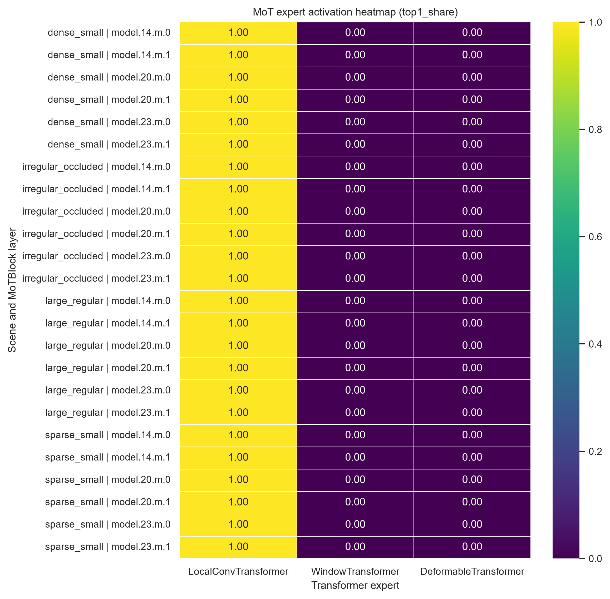

# E3 路由透视镜 · 8.24 准入检查（smoke/e3-admission）

**锁定 commit**：`3eb6cd914b651a06e2cd08ea87d12c28cab95502`（2026-08-23，main 分支）
**环境**：Python 3.11.9 + torch 2.13.0+cpu（CPU-only，Windows 本机复跑）
**验证方式**：三类路由（MoE / MoT / Latent）全部实测跑通，非纸面推演

---

## 一、怎么运行

MoT 路由 smoke test（官方合成场景脚本，无需数据集）：

```bash
python scripts/diagnose_mot_routing.py --synthetic --device cpu --nc 80
```

MoE 路由 smoke test（真实 coco8 数据集，自动下载）：

```python
from ultralytics import YOLO
from ultralytics.nn.modules.moe.analysis import ExpertUsageTracker

model = YOLO('ultralytics/cfg/models/master/v0_9/det/yolo-master-n.yaml')
with ExpertUsageTracker(model.model) as tracker:
    model.val(data='coco8.yaml', split='val', batch=1, device='cpu', verbose=False)
    print(tracker.usage_stats)
```

Latent Mixture 路由快照采集：

```python
from ultralytics import YOLO
import torch

model = YOLO('ultralytics/cfg/models/26/yolo26-master-latent-n.yaml')
m = model.model.eval()
with torch.no_grad():
    m(torch.randn(1, 3, 640, 640))

for name, mod in m.named_modules():
    snap = getattr(mod, 'last_routing_snapshot', None)
    if snap:
        print(name, list(snap.keys()))
```

## 二、使用什么场景

- **MoT**：官方脚本内置 4 类合成场景 `dense_small` / `large_regular` / `irregular_occluded` / `sparse_small`，纯合成输入，无需数据集
- **MoE**：真实 `coco8` 验证集（自动下载，4 张图）
- **Latent**：随机 640×640 单张输入 `torch.randn(1, 3, 640, 640)`

## 三、输出什么

MoT smoke test 生成 4 个文件：

- `mot_routing_detailed.csv`：逐层逐专家 `top1_share` / `mean_weight` / token 统计
- `mot_routing_scenarios.csv`：4 类场景 × 3 专家的 `top1_share` 均值
- `mot_deformable_activation_check.csv`：Deformable 专家激活显著性检查（baseline vs irregular 场景）
- `mot_expert_heatmap_top1_share.png`：专家 `top1_share` 热力图

MoE：`ExpertUsageTracker.usage_stats`（3 个 router 模块的专家 hits / weighted_sum）
Latent：`model.23` / `model.24` / `model.25` 的 `last_routing_snapshot`（36 个字段）

## 四、输出文件在哪里

- 运行原始输出：`runs/mot_ablation/routing/`（脚本自动写入；`runs/` 已被 `.gitignore` 忽略，不入库）
- 准入检查归档副本：`smoke/e3-admission/`（本目录，入库）
  - `e3_完整终端日志.txt`
  - `mot_routing_detailed.csv`
  - `mot_routing_scenarios.csv`
  - `mot_deformable_activation_check.csv`
  - `mot_expert_heatmap_top1_share.png`
- MoE 验证额外产物：`runs/detect/val-2`（coco8 val 结果）

## 五、如何判断结果成功

1. 完整日志包含 [1] MoT、[2] MoE、[3] Latent 三个段落，且以「日志生成完毕」结尾
2. **MoT**：命令退出码为 0；日志中 4 次出现 `[routing] wrote ...`（对应 4 个输出文件）；CSV 非空，覆盖 4 类场景 × 3 专家
3. **MoE**：`model.5.routing` / `model.8.routing` / `model.11.routing` 均显示 `✅ Hooked`；`usage_stats` 非空，hits / weighted_sum 为正常数值；coco8 val 4/4 跑完
4. **Latent**：`model.23/24/25` 均输出非空 `last_routing_snapshot`，字段数 35-36（随机初始化权重不同，重跑时字段数可能有 ±1 浮动，属正常现象）
5. 热力图 PNG 可正常打开，展示 4 类场景 × 3 专家的 `top1_share`

**真实观察（属预期基线现象，不是脚本 bug）**：未训练（随机初始化）模型在全部 4 类合成场景下，`LocalConvTransformer` 专家的 `top1_share` 恒为 1.00，另外两个专家为 0——初始化阶段即出现专家坍塌，这是训练前基线的真实特征。

## 六、现象命令（仅真实执行过的命令）

以下命令均来自 `e3_完整终端日志.txt`，为实际执行过的命令：

[1] MoT 路由 smoke test：

```bash
python scripts/diagnose_mot_routing.py --synthetic --device cpu --nc 80
```

[2] MoE 路由 smoke test（ExpertUsageTracker 用法）：

```python
from ultralytics import YOLO
from ultralytics.nn.modules.moe.analysis import ExpertUsageTracker

model = YOLO('ultralytics/cfg/models/master/v0_9/det/yolo-master-n.yaml')
with ExpertUsageTracker(model.model) as tracker:
    model.val(data='coco8.yaml', split='val', batch=1, device='cpu', verbose=False)
    print(tracker.usage_stats)
```

[3] Latent Mixture 路由快照采集：

```python
from ultralytics import YOLO
import torch

model = YOLO('ultralytics/cfg/models/26/yolo26-master-latent-n.yaml')
m = model.model.eval()
with torch.no_grad():
    m(torch.randn(1, 3, 640, 640))

for name, mod in m.named_modules():
    snap = getattr(mod, 'last_routing_snapshot', None)
    if snap:
        print(name, list(snap.keys()))
```

## 七、配置文件

使用 synthetic 场景，无额外 YAML 配置；运行参数见 README_CN.md。

> 注：三类路由使用仓库自带的模型 YAML（`ultralytics/cfg/models/master/v0_10/det/yolo-master-mot-n.yaml`、`ultralytics/cfg/models/master/v0_9/det/yolo-master-n.yaml`、`ultralytics/cfg/models/26/yolo26-master-latent-n.yaml`），均为内置配置，无外部独立配置文件。

## 八、完整日志

- 文件：`smoke/e3-admission/e3_完整终端日志.txt`
- GitHub：[e3_完整终端日志.txt](https://github.com/Aliferous-spec/YOLO-Master/blob/baseline/2026-08-22/smoke/e3-admission/e3_完整终端日志.txt)

## 九、结果截图

- 文件：`smoke/e3-admission/mot_expert_heatmap_top1_share.png`
- GitHub：[mot_expert_heatmap_top1_share.png](https://github.com/Aliferous-spec/YOLO-Master/blob/baseline/2026-08-22/smoke/e3-admission/mot_expert_heatmap_top1_share.png)
- 预览：



## 十、设计说明

（依据 E3 技术产出整理，按实际实现微调）

三类路由（MoE / MoT / Latent）的原生字段粒度差异很大，统一 schema 需要做字段对齐与降维，而不是简单拼接。统一字段草案：

| 统一字段（拟） | MoE 来源 | MoT 来源 | Latent 来源 | 说明 |
|---|---|---|---|---|
| `num_experts` | `num_experts` | `num_experts` | `num_experts` | 三类原生都有，可直接对齐 |
| `top_k` | `top_k` | `top_k` | `top_k` / `training_top_k` / `inference_top_k` | Latent 区分训练/推理两套 top_k，需要在统一层做归一 |
| `expert_usage` | 由 `ExpertUsageTracker.usage_stats` 聚合 hits/weighted_sum 推导 | `expert_usage`（直接张量） | `expert_usage` | 三类张量形状需统一为 `[num_experts]` 浮点列表 |
| `aux_loss` | 通过 `routing_protocol.RoutingAuxPublisher` 统一通道获取 | `aux_loss` | `aux_loss` | 唯一天然已经跨三类统一的字段 |
| `dominant_expert` / `dominant_share` | MoE 诊断类原生支持（`MoELayerDiagnostic`） | 需从 `expert_usage` 现算 | 需从 `expert_usage` 现算 | MoT/Latent 缺此字段，需在采集层补算 |
| `collapse_flag` | 原生支持 | 需自定义阈值判断（可复用 MoT 热力图观察到的坍塌案例） | 需自定义阈值判断 | 建议阈值可先沿用 MoE 侧的 0.8 |
| `scene_context` | 无 | `scene_aware` / `scene_stats` / `scene_bias` | 无 | MoT 独有字段，其余两类留空 |
| `value_fusion_*` | 无 | 无 | `value_fusion_mode` / `value_fusion_weights` | Latent 独有字段，体现其「融合」而非「选择」的路由范式 |

**核心难点**：MoE 偏向「离散选择」语义（dominant expert、collapse），MoT 带场景条件（scene-aware），Latent 是「连续融合」语义（value fusion），三者不是同一套路由范式的简单变体，统一 schema 需要设计一个带 `routing_paradigm` 标记位的父结构，而不是强行拉平字段。

**采集机制**：MoE 侧依赖 `ExpertUsageTracker` 的 hook 机制；MoT / Latent 原生自带 `last_routing_snapshot` 属性。两条实现路径并存，统一采集层需要做适配层（adapter），而非假设三类接口一致。

**开销测量（已实测，2026-08-25 本机复跑）**：

1. 对照组设计：同一模型、同一批数据，分别在「开启 hook 采集」与「关闭 hook」两种状态下跑 100 次前向，用 `time.perf_counter()` 分别记录总耗时
2. 测量口径：只测前向 + hook 回调耗时，不含数据加载和后处理
3. 验收标准：额外开销占比 = (开 hook 耗时 - 关 hook 耗时) / 关 hook 耗时，目标 < 10%
4. 降级方案：若开销超标，优先降级为「仅静态快照（forward 后一次性读取），不做逐 step 实时记录」，放弃实时面板，保留离线分析能力
5. **实测结果（2026-08-25，本机复跑）**：运行 `scripts/measure_routing_hook_overhead.py`（yolo-master-n @ 640×640，50 次前向）：关 hook 77.6 ms/次，开 hook 78.7 ms/次，**额外开销 1.50%**，满足 < 10% 目标

## 十一、风险与降级

- **风险1**：Latent 字段数量（35 个）远超 MoE/MoT，若三类强行统一为同一张表，会有大量空值列，可读性差 → **降级**：采用「公共字段 + 各类专属字段」两层结构，而非单一扁平表
- **风险2**：当前验证均为未训练模型（随机权重），坍塌现象是否为训练前特有还是训练后依然存在，尚未验证 → 后续需在真实训练 checkpoint 上复测
- **风险3**：MoE 侧目前依赖 `ExpertUsageTracker` 的 hook 机制，与 MoT/Latent 原生自带的 `last_routing_snapshot` 属性机制不是同一套实现路径 → 统一采集层需要做适配层（adapter），而非假设三类接口一致